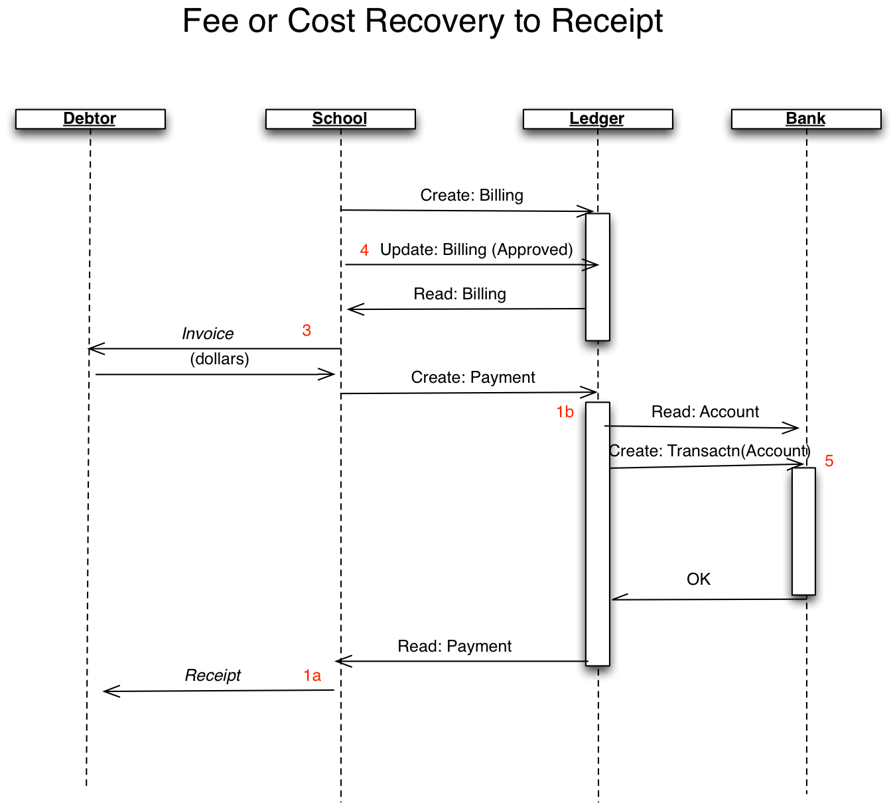
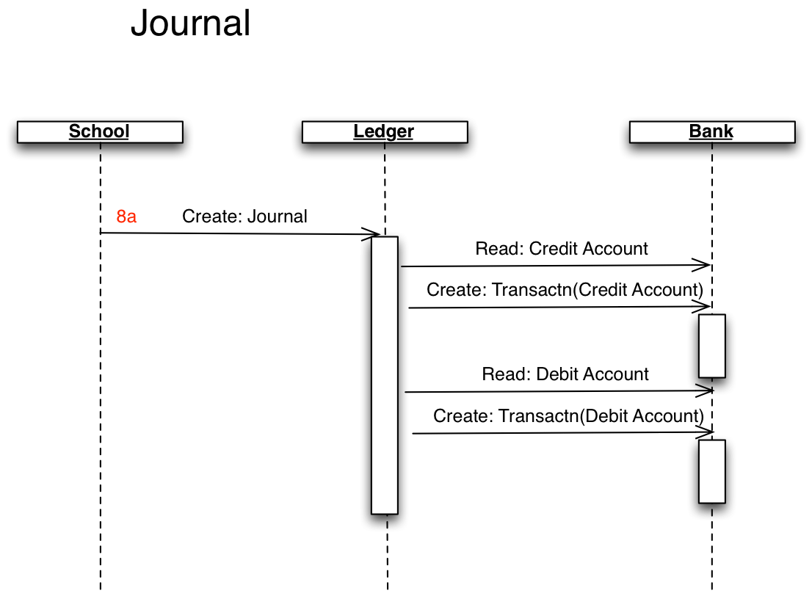
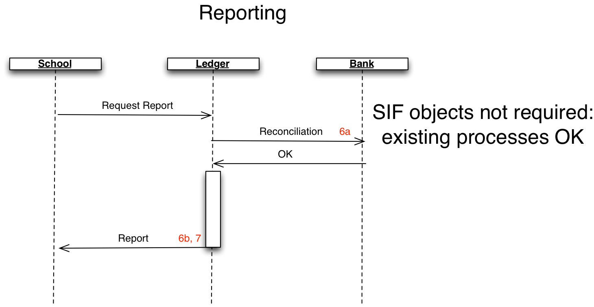
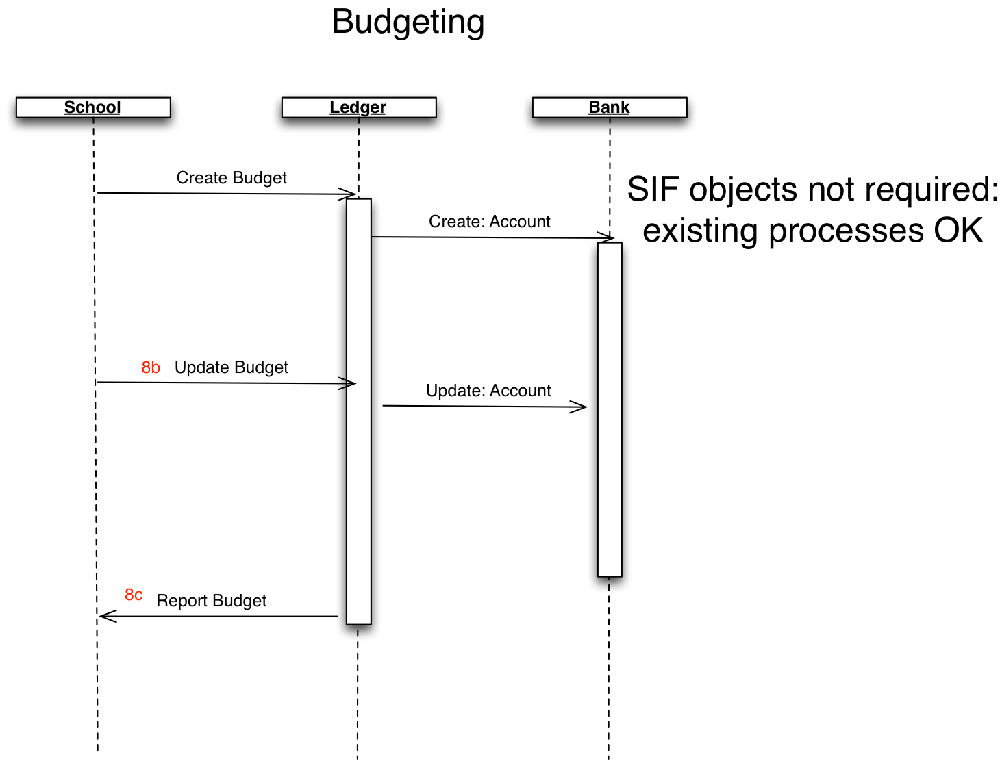

## Financial processing

### 1. What's the business problem?

Allow schools to carry out financial transactions using draft SIF
Financial objects, including purchase orders, receipts, invoices,
journalling, and payments. **[More...](#what-business-problem-does-this-usecase-address)**

### 2. Usecase description & pre-conditions

A 3rd Party Finance application connects to HITS as a jurisdiction hub,
collecting the relevant information and publishing back finances records
to the centralised system.

#### Assumptions:

3rd Party Vendor is a current supplier of a Finances product in
schools or has knowledge of finances reporting processes in K-12
Schools.

#### Pre-conditions:

-   Vendor has access to HITS
-   HITS has been provisioned with School Data
-   Vendor has mapped the relevant SIF Objects to their systems:
    -   Invoice
    -   FinancialAccount
    -   FinancialClassification
    -   ChargedLocationInfo
    -   PaymentReceipt
    -   PurchaseOrder
    -   VendorInfo
    -   Journal
    -   Debtor
    -   EquipmentInfo
    -   StaffPersonal
    -   StudentContactPersonal

(Note that some or all of these objects are proposed for SIF 1.4 and are
therefore not in the SIF 1.3 schema.
Here is [**a draft XSD schema for SIF
1.4**](http://kb.nsip.edu.au/download/attachments/13960456/SIF_Message1.4_3.x_current.zip),
and here are the **[draft specification
details](http://kb.nsip.edu.au/download/attachments/13960404/DSWG_V1.4_ChangeProposal_Financial_0.6.pdf)** for
the above objects.)

#### Usecase workflow summary:

1.  Join

2.  Consume

3.  Process

4.  Provide

5.  Assurance

#### Assurance:

The SIF/XML data sent by the 3rd Party app to the Jurisdiction Zone
for the app must satisfy the following conditions:
 -   Any SIF object published by the App must be valid against the SIF-AU 1.5draft1 schema (available
        on request)
 -   All mandatory elements of the submitted SIF objects are provided
 -   All SIF objects posted by the App must have referential integrity. Any RefId contained in the SIF
        object must refer to a SIF object provisioned to the App—e.g.
        AccountingPeriod, FinancialAccount—or to another SIF object
        posted by the App (e.g. Payment referring to Billing).This
        condition applies recursively to all additional SIF objects
        posted by the App. The test of this condition is done only when
        the App indicates that it has finished publishing to the Zone
        the objects required for the test.

**[More...](#usecase-preconditions-for-assurance)**

### 3. Join school zone

Join:

-   Third party app connects to Jurisdiction-established Zone for the
    School ("HITS Zone 1")
-   Third party app authenticates to Jurisdiction-established Zone for
    the School ("HITS Zone 1 Authz")
-   Jurisdiction Zone authorises read access to objects in the
    Jurisdiction Zone for the School ("HITS Zone 1 Authn")

### 4. Consume base data from HITS

Vendor-facing (pull); HITS represents the Jurisdiction and is the
data source for seed information.

-   Consume:
-   on the Jurisdiction-established Zone for the App, Third party app
    accesses all available AccountingPeriod, FinancialAccount,
    VendorInfo, and Debtor objects
-   Third party app ingests the relevant SIF Objects.

(The following is a list of calls that need to be made to consume the
required information)

1.  Get FinancialAccount: http://.../FinancialAccounts
2.  (Optional) http://.../FinancialClassifications,
    http://.../FinancialClassifications/{REFID}/FinancialAccounts (to
    retrieve all accounts in a ledger)
3.  Get VendorInfo: http://.../VendorInfos
4.  Get Debtor: http://.../Debtors
5.  Get LocationInfo: http://.../LocationInfos
6.  Get StaffPersonal: http://.../StaffPersonals
7.  Get StudentContactPersonal: http://.../StudentContactPersonals

Endpoints may support additional queries for retreiving data - refer to
**[Query-by-example or service paths](/docs/common/qbe_or_service_paths.md)** for HITS
guidance on queries.

### 5. Process in 3rd Party Application

3rd Party App uses the consumed data to generate appropriate transaction
information. The definition and automation of this process is out of
scope of HITs.

Steps:

-   Third party app processes information and gathers financials
    Information
-   Third party application creates return financials
    objects specific to the School
-   The transaction information generated by the App is represented by
    the following financials objects:
    -   PurchaseOrder
    -   Invoice
    -   PaymentReceipt
    -   Journal (transfer from one account to another)

**6. Provide authoritative data**

Prior to providing:

Third party expresses return information in SIF/XML:

-   Third party app connects to Jurisdiction-established Zone for the
    School ("HITS Zone 1")
-   Third party app authenticates to Jurisdiction-established Zone for
    the School ("HITS Zone 1 Authz")
-   Jurisdiction-established Zone authorises write access to objects in
    the Jurisdiction Zone for the School ("HITS Zone 1 Authn")
-   Following is provided by the 3^rd^ Party App back to HITs:
    1.  Post Invoice to URL http://.../Invoices
    2.  Post PaymentReceipt to URL http://../PaymentReceipts
    3.  Post PurchaseOrders to URL http://../PuchaseOrders
    4.  Post Journal to URL http://../Journals

7. Self – confirm usecase support
---------------------------------

1.  1.  Validate Invoice records
    2.  Validate PaymentReceipts records
    3.  Validate PurchaseOrder records
    4.  Validate
        Journal records

More information
================

#### What business problem does this usecase address?

###### In brief:

-   Allow schools secure access to finance information
-   Allow schools to use the financials product of their choice
-   Allow 3rd Party Financials apps automated access to base information
-   Allow 3rd Party Financials apps to publish financial data (including
    ledger updates) to a jurisdiction hub.

This use case responds to the growing interest in using SIF AU to
exchange financial data, and specifically to the ACT's integration
project. The objects proposed for use in this use case are tentative,
and will need to be further reviewed by the SIF AU Data Standards
Working Group (SIF AU DSWG),  to be included in SIF AU 1.4: they are
subject to change, and this use case will be the first time they are
used. Anyone seeking to engage with this use case is encouraged to
familiarise themselves with the proposed SIF AU financials objects,
available on request from NSIP.

This use case assumes that SIF is required only to exchange information
about individual transactions (e.g. purchase orders, invoices, receipts,
journals), and that reporting will be done out of existing
applications—although those reports may be based on the transactional
information received through SIF. 

This use case assumes that payroll transactions are out of scope.

This use case presupposes that there are processes in place for
transactions to take place with external parties (debtors and
creditors); it does not specify any mechanisms outside of SIF. A
purchase order for example may be transmitted to a vendor as a SIF
Purchasing object, or as a printed document drawing on information
included in the SIF Purchasing object. The mechanisms for generating and
sending such a printed document are outside the scope of this use case,
and would be provided by existing financial applications. 

The following lists the priority areas of interest to the ACT in
finance:

1.  Receipting – the ability to produce receipts for (1a) Families/
    Debtors and (1b) General Ledgers.
2.  Purchase Orders – the ability to (2a) produce commitments into
    ledgers for purchases and (2b) send these to creditors as an
    approval method for purchases. We also need to be able to (2c) draw
    down the purchase order at time of payment to enable the commitment
    to be used.
3.  Invoices – The ability to produce invoice for Debtors, recovery of
    hire costs in particular.
4.  At present we enter into our system invoices to get these approved
    before the payment is produced and sent off.
5.  Payments – we need to be able to produce a file to be imported into
    the bank as majority of our payments are made through EFT but we
    need to be able to produce cheques also.
6.  We need to be able to run an end of period process including (6a) a
    bank reconciliation and (6b) produce reports that go to the
    Principal, school board, provides the basis of producing the monthly
    BAS and gives reports to various teachers, faculty or as requested.
7.  We need to be able to run end of year as schools operate on a
    calendar year rather than financial year.
8.  We also need to be able to do (8a) journals to correct ledger
    errors, GST errors and (8b) need to be able to make adjustments to
    the schools budget, also (8c) produce the schools budget prior to
    presentation and approval of the budget.

The following three workflows are SIF-based exchanges which realise most
of the ACT priority areas:

The following two workflows represent reporting processes which do not
require SIF support, as they are already provided within applications:

#### Usecase preconditions for assurance

None.
